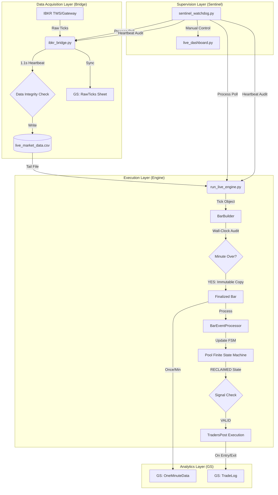

# KaizenICT System Workflow (V2.1)
**Architecture**: Single-Authority Authoritative Feed  
**Core Objective**: Clinical 1Hz Data Fidelity & 1-Minute Strategy Execution

---

## 🛰️ SYSTEM ARCHITECTURE OVERVIEW
The system operates as a **Causal Pipeline**. Each stage depends strictly on the one before it, ensuring zero lookahead bias and perfect temporal alignment.

---

## 🧵 THE 10-STEP CAUSAL LIFECYCLE

### 1. The Pulse (Bridge)
The `ibkr_bridge.py` connects to IBKR and initiates a high-fidelity 1Hz heartbeat. Every tick received is appended to `live_market_data.csv`.

### 2. High-Speed Batching (GS Logger)
To satisfy Google Sheets API quotas, the Bridge batches all ticks from the last 1.1 seconds and flushes them in a single `append_rows` call. This ensures 1Hz visual fidelity on the sheet without hitting a 429 Error.

### 3. The Tail (Engine)
The `run_live_engine.py` "tails" the CSV file. It reads every new line instantly (0.5s poll) and converts it into a `Tick` object.

### 4. Wall-Clock Authority (BarBuilder)
The `BarBuilder` compares the current time against the `bar_end_time`. It **refuses** to close a bar based on tick arrival; it only closes when the authoritative system clock hits the 60-second mark.

### 5. The Immutable Snapshot
When a bar closes, the `BarBuilder` creates a `deepcopy` of the data. This snapshot is **Immutable**. All strategy decisions are made on this snapshot, never on the "Live" buffer.

### 6. Displacement Audit (FSM)
The Engine feeds the Immutable Bar into the `PoolFSM`. The FSM checks if the bar has "Displacement" (`Body > 50% of Range`). If it does, and price reclaimed a pool level, the state transitions to `RECLAIMED`.

### 7. Signal Emission
Once a pool hits `RECLAIMED`, the `SessionManager` emits a signal. This signal contains the pre-calculated Entry, Stop Loss ($2/pt for MNQ), and Take Profit.

### 8. Execution Bridge (TradersPost)
The `TradersPostBroker` formats the signal into a JSON payload and hits the Webhook. It includes a **Rate Limit Guard** to prevent "Over-trading" (Max 30 orders/hour).

### 9. Risk Reconciliation
After a fill, the `RiskGuard` syncs with the FSM. It updates the **Daily Loss Limit ($450)** and checking for "Phantom Trades" (FSM thinks we are in, but Broker says we are flat).

### 10. The Sentinel Watchdog
Throughout this entire process, the `sentinel_watchdog.py` performs a "Binary Health Check" every 5 seconds. If the Bridge stops writing to its stats file (Heartbeat Fail) or the Engine process dies, the Sentinel **auto-revies** it in a fresh console window within 15 seconds.

---

## 📊 OPERATIONAL GAUGES
| Component | Authority | Cadence | Logging authority |
| :--- | :--- | :--- | :--- |
| **Bridge** | Market Feed | 1Hz (Continuous) | `RawTicks` |
| **Engine** | Wall Clock | 1min (Clinical) | `OneMinuteData` |
| **Sentinel** | System Uptime | 5s (Supervisor) | `sentinel.log` |

**Workflow Verified & Certified (V2.1)** 🛡️📈🚀
